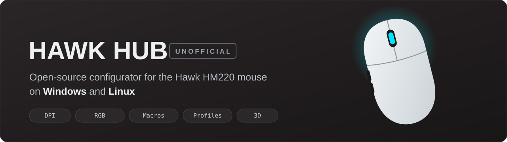
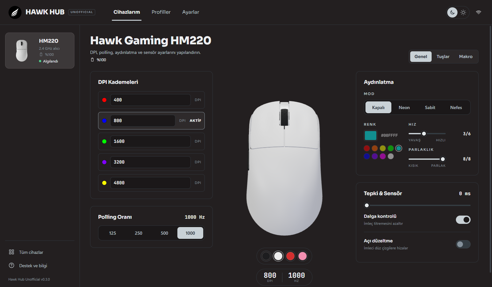
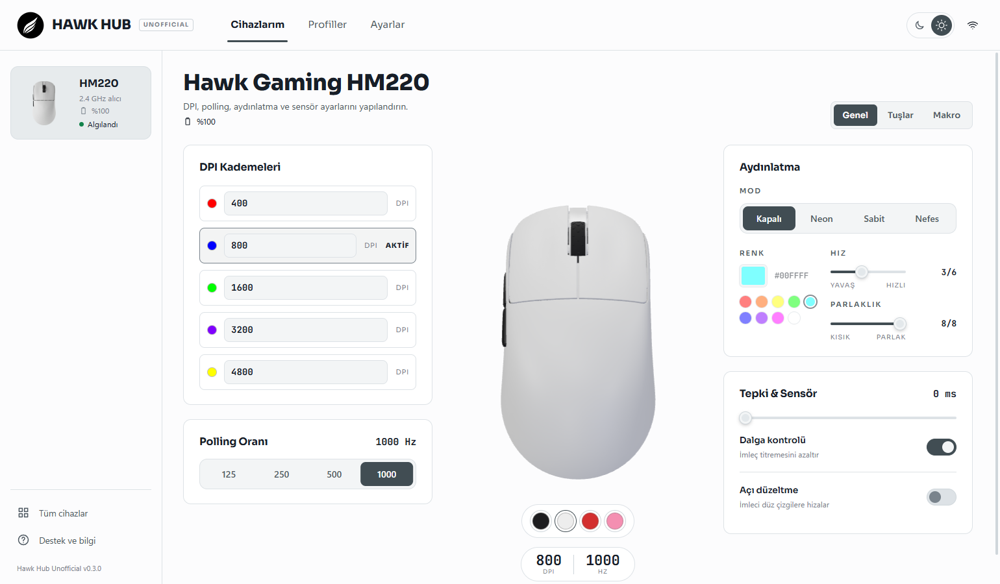
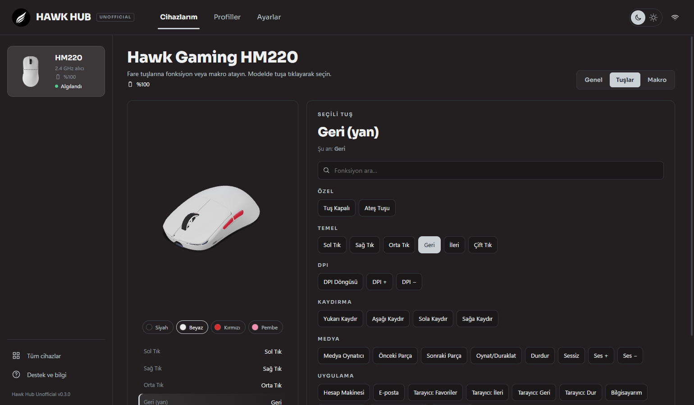
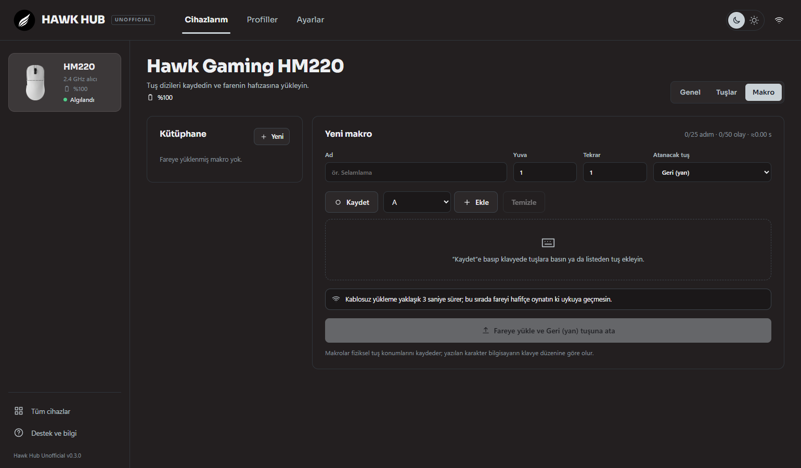
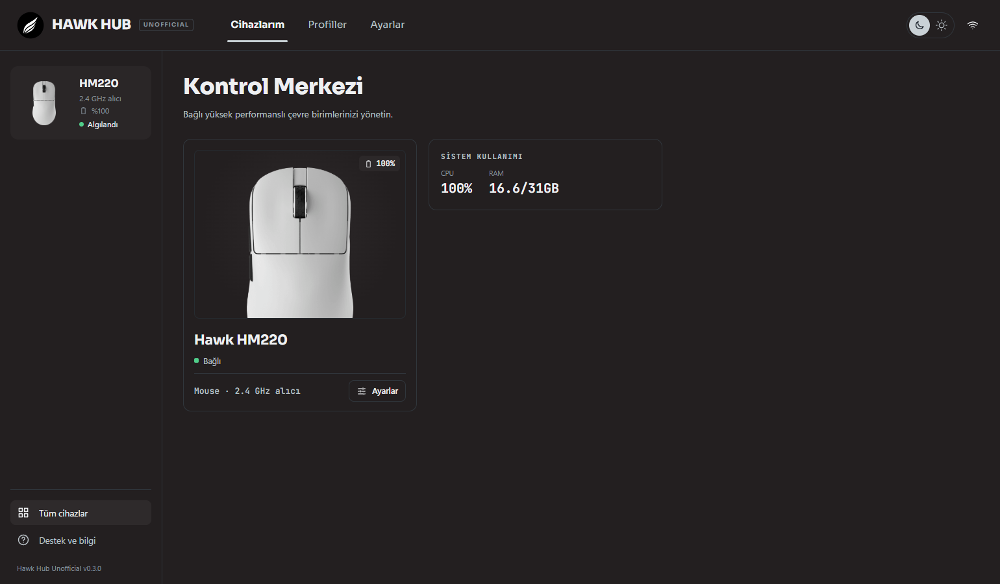

<p align="center">
  
</p>

<p align="center">
  <a href="#install"></a>
  
  
  
  <a href="LICENSE"></a>
</p>

<p align="center">
  <b>A faster, lighter and cross-platform alternative to the official Hawk Hub app.</b><br>
  Built from scratch in Rust by reverse-engineering the mouse's USB HID protocol.
</p>

<p align="center">
  
</p>

> [!IMPORTANT]
> **This is an unofficial, community project.** It is not affiliated with, endorsed by, or supported by Hawk Chair.
> "Hawk", the Hawk logo, the product photos and the 3D models are property of Hawk Chair. Product photos and 3D
> models are **not** stored in this repository; they are fetched from your local Hawk Hub install / Hawk's website
> at build time.

---

## Why not the official app?

| | Official Hawk Hub (1.0.20-beta) | Hawk Hub Unofficial |
|---|---|---|
| **Platforms** | Windows only | Windows **and Linux** (Linux build not yet tested on hardware, see [Roadmap](#roadmap)) |
| **Footprint** | ~414 MB installed (Electron) | ~18 MB single executable (Rust + Tauri), 3D models included |
| **HM220 lighting** | Sends LED commands with a wrong checksum. The mouse rejects them, so the light cannot be turned off or recoloured | Correct checksum, verified on real hardware. Colours are calibrated so what you pick is what the LED shows |
| **Mouse preview** | Static product photos | Interactive 3D model with live LED animation. Click a button on the model to remap it |
| **Per-app profiles** | No | A profile is applied automatically when its linked game or app comes to the foreground |
| **Command-line tool** | No | `hawk-hm220` CLI for scripting and automation |
| **Source code** | Closed | Open source (MIT) |

<sub>Compared against Hawk Hub 1.0.20-beta on Windows 11 with an HM220 V2. Sizes are measured on disk.</sub>

## Highlights

| Feature | Details |
|---|---|
| **Live 3D model** | Hawk's own HM220 model, rendered with three.js. The wheel light animates in sync with your real mouse: static, breathing, neon. Click a button on the model to remap it. |
| **DPI & sensor** | 5 DPI stages (100 – 12 000), active stage, polling rate (125 – 1000 Hz), debounce (0 – 12 ms), ripple control and angle snapping. |
| **Lighting** | Off / neon / static / breathing, HSV colour picker, presets, brightness and speed. Colours are calibrated so what you pick is what the LED shows. |
| **Button remapping** | Every button can be any mouse, DPI, scroll, media or app function. Includes a searchable function list and left-click lock-out protection. |
| **Macros** | Record from your keyboard with timing, or build step by step. Uploads to the mouse's own memory over **cable or 2.4 GHz**. |
| **Profiles** | Save, apply and export/import as JSON. Each profile can have its own colour and icon, including the linked program's real icon. |
| **Auto-switch** | Link a profile to a game or app: it is applied when that window comes to the foreground and reverts to your default afterwards. |
| **Live device sync** | Battery level, plug/unplug detection, DPI button presses and on-device profile changes are reflected in the UI instantly. |
| **Dark & light themes** | Follows the design language of the official app: top tabs, device rail, centred 3D stage. |
| **Developer panel + CLI** | Raw HID frames with checksums highlighted, a send log, and a full command-line tool for scripting. |

## Screenshots

<table>
  <tr>
    <td width="50%"><p align="center"><sub>Light theme</sub></p></td>
    <td width="50%"><p align="center"><sub>Button remapping on the 3D model</sub></p></td>
  </tr>
  <tr>
    <td width="50%"><p align="center"><sub>Macro recorder</sub></p></td>
    <td width="50%"><p align="center"><sub>Control center</sub></p></td>
  </tr>
</table>

> The interface is currently in **Turkish**. English translation is on the roadmap. PRs are welcome!

## Supported devices

| Device | Connection | USB ID | Status |
|---|---|---|---|
| **Hawk HM220 V2** (PAW3311) | Wired | `1d57:2027` | Fully supported |
| **Hawk HM220 V2** (PAW3311) | 2.4 GHz receiver | `1d57:fa60` | Fully supported, including wireless macro upload |

Other Hawk devices (HM420, HM620, HK keyboards, HS420 headset) use different protocols and are not supported yet.

<a id="install"></a>
## Install & build

There are no prebuilt releases yet; build from source.

### Requirements

- [Rust](https://rustup.rs) (stable) and [Node.js](https://nodejs.org) 20+
- **Windows:** Visual Studio C++ Build Tools and WebView2 (preinstalled on Windows 11)
- **Linux:** Tauri's system packages. On Debian/Ubuntu:

  ```bash
  sudo apt install libwebkit2gtk-4.1-dev build-essential curl wget file libxdo-dev libssl-dev libayatana-appindicator3-dev librsvg2-dev
  ```

### Build

```bash
git clone https://github.com/WinTone01/hawk-hub-unofficial.git
cd hawk-hub-unofficial/app
npm install
npm run tauri build      # Windows: NSIS installer · Linux: .deb, .rpm, AppImage
```

During the build, `npm run assets` downloads the HM220 3D models from Hawk's website. Product photos and the logo
are copied from a local Hawk Hub extraction (`re/app`, see below) when present. Without them the app falls back to
built-in drawings, and everything still works.

### Linux: device permissions

The app talks to the mouse through `/dev/hidraw*`. Install the udev rule so it works without `sudo`
(the `.deb` / `.rpm` packages do this automatically):

```bash
sudo cp 99-hawk-hub.rules /etc/udev/rules.d/
sudo udevadm control --reload && sudo udevadm trigger
```

Foreground detection for profile auto-switching uses `xprop` (X11 / XWayland). On pure Wayland it falls back to
"the linked program is running".

## Command-line tool

The `hm220` crate ships a CLI (`hawk-hm220`) that shares settings and profiles with the app:

```bash
cargo run -p hm220 -- list                                   # connected mice
cargo run -p hm220 -- battery
cargo run -p hm220 -- sync                                   # read the mouse's real settings
cargo run -p hm220 -- dpi --set 1:400 --set 2:1200 --stage 2
cargo run -p hm220 -- polling 1000
cargo run -p hm220 -- led --mode breathing --color 00e5ff --brightness 8 --speed 2
cargo run -p hm220 -- button forward dpi-cycle               # see `functions`
cargo run -p hm220 -- macro back --id 1 --steps 'h:50,i:50,enter:30'
cargo run -p hm220 -- --dry-run led --mode off               # print frames without writing
cargo run -p hm220 -- listen                                 # watch device events
```

Settings and profiles live in `~/.config/hawk-hub/` (Linux) or `%APPDATA%\hawk-hub-unofficial\` (Windows).

## How it works

```
┌──────────────────────────┐   Tauri commands   ┌──────────────────────────┐   HID feature reports
│  app/src  (Svelte 5, TS) │ ─────────────────▶ │ app/src-tauri  (Rust)    │ ───────────────────────┐
│  three.js 3D stage       │ ◀───────────────── │ device watcher, auto-    │                        ▼
└──────────────────────────┘   events (battery, │ switch, program icons    │        ┌───────────────────────────┐
                               DPI, profile)    └────────────┬─────────────┘        │  Hawk HM220 (Beken MCU)   │
                                                             │ uses                 └───────────────────────────┘
                                                ┌────────────▼─────────────┐                        ▲
                                                │ hm220  (Rust library)    │ ───────────────────────┘
                                                │ protocol · session · CLI │   Linux: hidraw ioctl
                                                └──────────────────────────┘   Windows: hidapi
```

| Path | Contents |
|---|---|
| [`hm220/`](hm220) | Protocol encoding, checksums, settings/profile storage, HID access and the `hawk-hm220` CLI |
| [`app/src/`](app/src) | UI: Svelte 5 + TypeScript + Vite + three.js |
| [`app/src-tauri/`](app/src-tauri) | Tauri 2 backend: commands, device watcher, profile auto-switch, program icons |
| [`PROTOCOL.md`](PROTOCOL.md) | Reverse-engineered HM220 protocol: reports, checksums, events, macro format, wireless quirks |

Every setting is acknowledged by the mouse (`03 5c 50 <status> <report>`), so the app knows when a write really
landed. Settings are read back from the mouse on connect, so changes made with the DPI button or another app show up.

## Development

```bash
cd app
npm run tauri dev        # full app with hot reload
npm run dev              # UI only, in the browser with a mock mouse (http://localhost:1420)
npm run check            # svelte-check / TypeScript
cargo test -p hm220      # protocol tests (from the repo root)
```

The mock backend in [`app/src/lib/api.ts`](app/src/lib/api.ts) lets you work on the UI without the hardware.

### Reverse-engineering notes

The protocol was worked out from the official Electron app and confirmed on real hardware. Everything verified on hardware
is marked as such in [PROTOCOL.md](PROTOCOL.md). To inspect the official app yourself, extract its `app.asar` into
`re/app` with [`re/extract-asar.ps1`](re/extract-asar.ps1). That folder is git-ignored because it is proprietary code.

## Roadmap

- [ ] Prebuilt releases (Windows installer, AppImage, .deb/.rpm)
- [ ] English UI (i18n)
- [ ] Tested Linux build. The Linux code paths are written but have not been run on real hardware yet.
- [ ] More Hawk devices (HM420 / HM620, HK keyboards)
- [ ] Start with the system and live in the tray

## Credits

- [attack-shark-x11-driver](https://github.com/HarukaYamamoto0/attack-shark-x11-driver) by HarukaYamamoto0 (MIT).
  The Attack Shark X11 uses the same Beken firmware family, and its documentation was the key reference for the
  macro format.
- [Tauri](https://tauri.app), [Svelte](https://svelte.dev), [three.js](https://threejs.org),
  [hidapi](https://github.com/ruabmbua/hidapi-rs), [sysinfo](https://github.com/GuillaumeGomez/sysinfo).

## License

[MIT](LICENSE) for the source code in this repository. Hawk trademarks, the logo, product photos and 3D models belong
to Hawk Chair and are **not** covered by this license.
